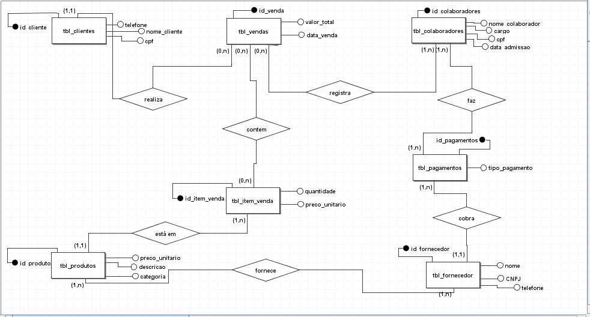
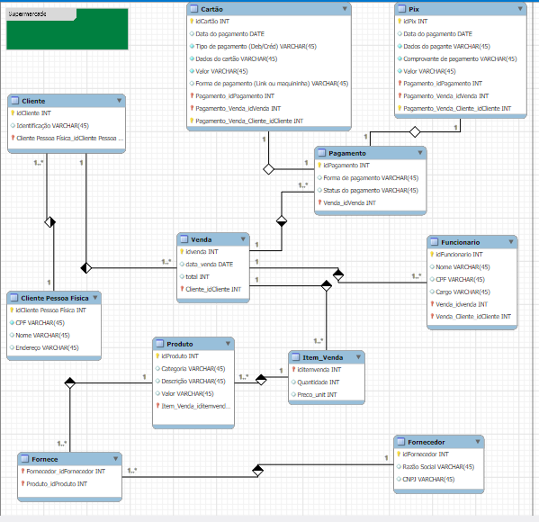

# 🛒 Sistema de Banco de Dados — Supermercado R&A

## 📖 Descrição
Este projeto apresenta o desenvolvimento completo de um banco de dados para gerenciamento de vendas de um supermercado.

O sistema foi projetado para organizar e armazenar informações de clientes, produtos, colaboradores, fornecedores, vendas e pagamentos, substituindo controles manuais por um modelo estruturado e automatizado. :contentReference[oaicite:3]{index=3}

---

## 🎯 Objetivo
Criar um banco de dados relacional que permita:

- Controle de clientes
- Gestão de produtos e estoque
- Registro de vendas
- Controle de colaboradores
- Gestão de fornecedores
- Processamento de pagamentos
- Geração de relatórios

---

## 🧠 Etapas do projeto

O projeto foi dividido em três fases principais:

### 🔹 1. Modelagem Conceitual (MER)
Representação das entidades e relacionamentos do sistema.

### 🔹 2. Modelagem Lógica (DER)
Definição das tabelas, atributos, chaves primárias e estrangeiras.

### 🔹 3. Modelagem Física (SQL)
Implementação completa do banco de dados no MySQL com scripts SQL. :contentReference[oaicite:4]{index=4}

---

## 🗂️ Principais Entidades

- Clientes
- Produtos
- Colaboradores
- Vendas
- Itens de Venda
- Fornecedores
- Pagamentos

O banco foi estruturado para garantir integridade dos dados e relacionamento entre as tabelas. :contentReference[oaicite:5]{index=5}

---

## 🖼️ Modelagem do Banco

### 📌 MER (Modelo Conceitual)


### 📌 DER (Modelo Lógico)


---

## 🛠️ Tecnologias utilizadas

- MySQL
- SQL
- Draw.io / brModelo
- MySQL Workbench

---

## ⚙️ Funcionalidades do sistema

- Cadastro de clientes
- Cadastro de produtos
- Controle de estoque automático
- Registro de vendas
- Associação de itens por venda
- Controle de pagamentos
- Relatórios com consultas SQL

---

## 💾 Script do Banco de Dados

O banco foi implementado com:

- Criação de tabelas com PK e FK
- Relacionamentos entre entidades
- Integridade referencial
- Estrutura escalável :contentReference[oaicite:6]{index=6}

---

## 📊 Consultas SQL

Exemplo de consulta:

```sql
SELECT 
  v.id AS id_venda,
  c.nome_cliente,
  v.data_venda,
  p.descricao AS produto,
  i.quantidade,
  i.preco_unitario,
  (i.quantidade * i.preco_unitario) AS subtotal,
  v.valor_total
FROM tbl_vendas v
LEFT JOIN tbl_cliente c ON v.tbl_cliente_id = c.id
LEFT JOIN tbl_item_vendas i ON v.id = i.tbl_vendas_id
LEFT JOIN tbl_produto p ON i.tbl_produto_id = p.id;
``` id="sql01"

---

## 📄 Documentação

- 📎 [Parte Teórica](./docs/parte-teorica.pdf)
- 📎 [Parte Prática](./docs/parte-pratica.pdf)
- 📎 [Apresentação](./docs/apresentacao-db.pdf)

---

## 📂 Estrutura do projeto

supermercado-ra-db/
├── README.md
├── docs/
├── modelagem/
├── sql/


---

## 📈 Resultados

- Modelagem completa de banco de dados
- Aplicação prática de SQL
- Integração entre entidades
- Criação de consultas complexas
- Estrutura pronta para sistemas reais

---

## 💡 Aprendizados

Este projeto demonstra a importância da modelagem de dados e da organização das informações em sistemas reais, permitindo controle eficiente e tomada de decisão baseada em dados.

---

## 👨‍💻 Autor

**Adriano Mantoan**  
Técnico em Segurança do Trabalho  
Estudante de Engenharia da Computação  

📍 Suzano - SP